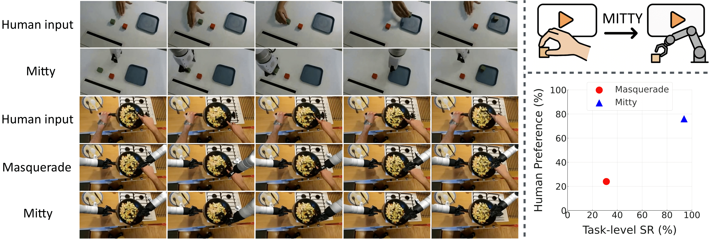

# Mitty
> **Mitty: Diffusion-based Human-to-Robot Video Generation**
> <br>
> [Yiren Song](https://scholar.google.com.hk/citations?user=L2YS0jgAAAAJ), 
> [Cheng Liu](https://scholar.google.com.hk/citations?hl=zh-CN&user=TvdVuAYAAAAJ), 
> [Weijia Mao](https://scholar.google.com.hk/citations?hl=zh-CN&user=TvdVuAYAAAAJ), 
> and 
> [Mike Zheng Shou](https://scholar.google.com/citations?user=S7bGBmkyNtEC)
> <br>
> [Show Lab](https://sites.google.com/view/showlab), National University of Singapore
> <br>

<a href="https://arxiv.org/abs/xxx"></a>
<a href="https://huggingface.co/spaces/xxxx/xxxx"></a>
<a href="https://huggingface.co/spaces/xxxx/xxxx"></a>
<a href="https://huggingface.co/xxxx/xxxx"></a>
<a href="https://huggingface.co/datasets/xxxx/xxxx/"></a>

<br>




## 🔧 Environment & Installation

### 1. Create environment

```bash
conda create -n mitty python=3.10 -y
conda activate mitty
```

### 2. Install dependencies

```bash
pip install -r requirements.txt
```

---

## 📦 HuggingFace Models & Datasets

### 1. Pretrained model

The fine-tuned Mitty models will be available at:

- **Model:**
  - `https://huggingface.co/showlab/Mitty_Model`


### 2. Dataset

The paired human–robot dataset will be released as a HuggingFace dataset:

- **Dataset:**
  - `https://huggingface.co/datasets/showlab/Mitty_Dataset`

A recommended format is:

```text
dataset/
  ├── human/
  │   ├── xxx_00001.mp4
  │   ├── xxx_00001.txt # prompt
  │   └── ...
  ├── robot/
  │   ├── xxx_00001.mp4
  │   └── ...
```

---

## 🚀 Training & 🎬 Inference

We provide simple shell scripts to launch training and inference.

### 1. Training

Edit `_scripts/train.sh` to set your dataset paths, output directory, and training hyperparameters.  
Then run:

```bash
bash _scripts/train.sh
```

This will start training Mitty on the paired human–robot dataset.

### 2. Inference

Edit `_scripts/inference.sh` to point to your trained checkpoint (or the released pretrained model) and specify the input human video / prompt and output directory.  
Then run:

```bash
bash _scripts/inference.sh
```

This will generate corresponding robot videos from the human inputs using the Mitty model.


---

## 📚 Citation

If you use this codebase or the released models / dataset in your research, please cite the Mitty paper.  

```bibtex
@article{mitty2025,
    title  = {Mitty: Diffusion-based Human-to-Robot Video Generation},
    author = {Yiren Song and Cheng Liu and Weijia Mao and Mike Zheng Shou},
    year   = {2025},
}
```

